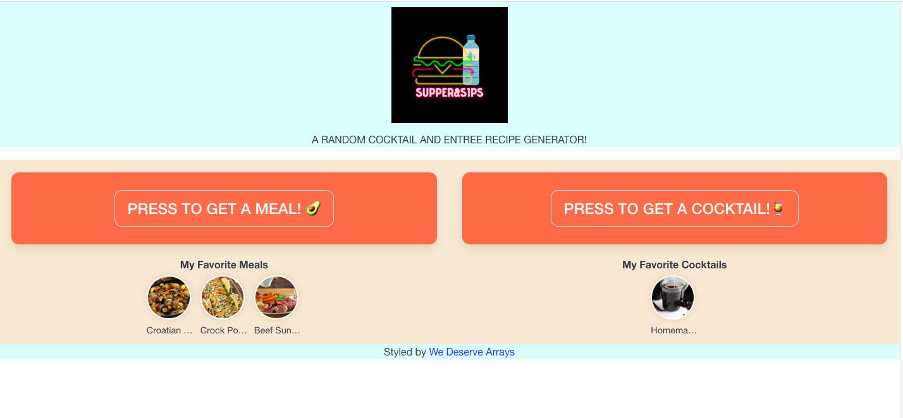

# Supper-and-Sips
An app to randomly choose dinner and drink recipes.

## Description
Our food ontology and semantic recipe search engine makes it possible to search for recipes using natural language queries, such as "chicken recepies" or just "pasta recepies" or even complicated dishes like "low fat vegan cupcakes".

## Screenshots and GIFs of live site

Loading page: 


Random Generation of an entrée:


Revisiting a favorited selection:


### Dependencies

* Google Chrome
* Windows 10

### Installing

* No installation required
* Project can be directly accesed using the link of deployed application

### Executing program

* Access the page using the [GitHub Pages](https://tjmcd2010.github.io/Supper-and-Sips/)

## Help

Any advise for common problems or issues.
```
command to run if program contains helper info
```

## Authors

Contributors names and contact info

* Anira Raveendran
[@aniraannu](https://github.com/aniraannu)
* Amrinderjeet Kaur
[@AJKaur02](https://github.com/AJKaur02)
* Jose Arambula
[@daimyo1](https://github.com/daimyo1)
* Travis McDermott
[@tjmcd2010](https://github.com/tjmcd2010)

## Version History

* 0.1
    * Initial Release

## License

None

## Acknowledgments

Inspiration, code snippets, etc.
* [dbader](https://github.com/dbader/readme-template)
